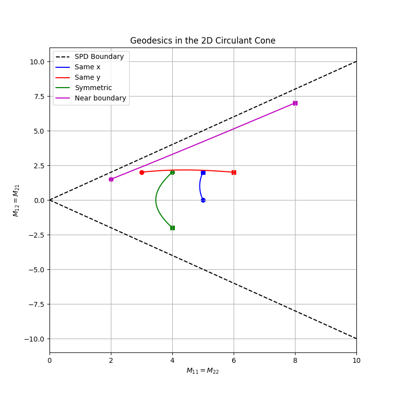

I was working on some homework for a course on *Geometric Deep
Learning*. The context was differential geometry, more specifically the
manifold of Symmetric Positive Definite (SPD) matrices. The exercise had
us thinking about a notion of distance for this manifold. It also was
presenting it as an example of the algebraic concept of a [convex
cone](https://en.wikipedia.org/wiki/Convex_cone). I was left wondering:
where do *circulant matrices* live in all of this?

### SPD matrices

If you end up on this page, I take it for granted you know what a
symmetric matrix is. As for the Positive Definite part, the way I think
about them is like a "stretching" operator: feed it any vector, and this
thing will:

1.  rotate it to "align it" to an orthogonal basis;
2.  stretch/scale every component by a strictly positive number;
3.  undo the rotation you did at the beginning.

Importantly, an positive definite matrix has strictly positive
determinant. More info is [on
Wikipedia](https://en.wikipedia.org/wiki/Definite_matrix), of course.
You may find SPD matrices in the following contexts:

-   as *covariance matrices* (if it is a *sample* covariance, you may
    need "enough" samples, so that it is not rank deficient);
-   as *metric tensors*, once you specify some coordinate system;
-   as *Gram matrices*, in the context of kernel methods;
-   and, I assume, many more.

### The manifold of SPD matrices

Imagine an [\\(n \\times n\\)]{.math .inline} matrix
[\\(\\mathcal{M}\\)]{.math .inline} that is symmetric and positive
definite. Due to its symmetry, you only actually need to specify
[\\(n(n+1)/2\\)]{.math .inline} elements to characterize the matrix. You
can then think of this matrix as a point in the space
[\\(\\mathbb{R}\^{n(n+1)/2}\\)]{.math .inline}. The set of all such
points that correspond to a symmetric positive definite matrix forms a
*manifold*. It is possible to endow this manifold with a *metric*, that
is, a way to "measure distance" between two of its points, thus creating
a *Riemannian manifold*. We call this manifold
[\\(\\mathcal{S}\_{++}\^n\\)]{.math .inline}.

A careful discussion of Riemannian manifolds is a bit outside of my
capabilities, but resources are plentiful if you crave some big boy
maths.

It is instructive and amusing to check what this manifold may look like
in practice. Choose [\\(n=2\\)]{.math .inline}, so that matrices (which
are symmetric!) are of the type

[\\\[ \\mathcal{M} = \\begin{pmatrix} x & z \\\\ z & y \\end{pmatrix}.
\\\]]{.math .display}

Additionally, we need to satisfy the requirements

[\\\[ \\det \\mathcal{M} = xy - z\^2 \>0, \\quad x\>0, \\quad y\>0.
\\\]]{.math .display}

These are needed for the positive-definiteness requirement. The matrix
[\\(\\mathcal{M}\\)]{.math .inline} above can be represented as the
point [\\((x, y, z)\\in \\mathbb{R}\^3\\)]{.math .inline}. We can think
of the manifold as the following subset of [\\(\\mathbb{R}\^3\\)]{.math
.inline}:

[\\\[ \\mathcal{S}\_{++}\^2 = \\{(x, y, z) \\in \\mathbb{R}\^3 \|
xy-z\^2\>0, x\>0, y\>0\\}. \\\]]{.math .display}

Feed this to `matplotlib`, and you get this:

<figure id="fig:cone">

<figcaption aria-hidden="true">The convex cone structure for a 2D SPD
matrix.</figcaption>
</figure>

This really looks like a *geometric* cone, and it also happens to be an
[*algebraic* cone](https://en.wikipedia.org/wiki/Convex_cone).

### Distance between SPD matrices

One can define a notion of distance between two SPD matrices [\\(P, Q
\\in \\mathcal{S}\_{++}\^n\\)]{.math .inline}, as done in [this
paper](http://www.ipb.uni-bonn.de/pdfs/Forstner1999Metric.pdf): The
formula looks like this:

[\\\[ d(P, Q) = \\sqrt{\\sum\_{i=1}\^n \\ln\^2 \\lambda_i(P, Q)},
\\\]]{.math .display}

where [\\(\\lambda_i(P, Q)\\)]{.math .inline} denotes the
[\\(i\\)]{.math .inline}-th eigenvalue that can be obtained by solving
the equation

[\\\[ \\det(\\lambda P - Q) = 0. \\\]]{.math .display}

#### Geodesics

Similarly, we can define a *geodesic* between two SPD matrices, [\\(P, Q
\\in \\mathcal{S}\_{++}\^n\\)]{.math .inline}, with the following
formula:

[\\\[ \\gamma(t) = P\^{1/2}(P\^{-1/2}QP\^{-1/2})\^tP\^{1/2}, \\quad
t\\in\[0,1\]. \\\]]{.math .display}

For any [\\(t\\in\[0, 1\]\\)]{.math .inline}, [\\(\\gamma(t)\\)]{.math
.inline} is an SPD matrix. Here is some `JAX` code to get this geodesic:

::: {#cb1 .sourceCode}
``` {.sourceCode .python}
# Geodesics for the SPD cone
import jax
from jax import numpy as jnp
from typing import Callable


def get_geodesic(P: jax.Array, Q: jax.Array) -> Callable:
    Op, Sp, OpT = jnp.linalg.svd(P, hermitian=True)
    Phalf = (Op * jnp.sqrt(Sp)) @ OpT
    Pmhalf = (Op * (1/jnp.sqrt(Sp))) @ OpT
    pow = Pmhalf @ Q @ Pmhalf
    Opow, Spow, OpowT = jnp.linalg.svd(pow, hermitian=True)
    def gamma(t: float) -> jax.Array:
        return Phalf @ ((Opow * (Spow**t)) @ OpowT) @ Phalf
    return gamma


# example usage
P1 = jnp.array([ [3, 1], [1, 4]] )
Q1 = jnp.array([ [1, 0], [0, 1]] )
gamma = get_geodesic(P1, Q1)
times = jnp.linspace(0, 1, 100)
path = vmap(gamma)(times)
```
:::

Using this code and a bit of 3D plotting, we get this gif, showing a few
geodesics in the [\\(\\mathcal{S}\_{++}\^2\\)]{.math .inline} manifold.

<figure id="fig:geodesic">

<figcaption>A few geodesics in the <span
class="math inline">\(\mathcal{S}_{++}^2\)</span> manifold.</figcaption>
</figure>

### Circulant matrices

Now, let's move to [circulant
matrices](https://en.wikipedia.org/wiki/Circulant_matrix) that also
happen to be SPD.

Let us start from the case [\\(n=2\\)]{.math .inline}. A 2 by 2,
positive definite circulant matrix can be written as

[\\\[ \\mathcal{M} = \\begin{pmatrix} x & z \\\\ z & x \\end{pmatrix},
\\\]]{.math .display}

with [\\(x\>0\\)]{.math .inline} and [\\(\|z\| \< x\\)]{.math .inline}.
This is a manifold, too! I will call it
[\\(\\mathcal{C}\_{++}\^2\\)]{.math .inline}; this is a 2D manifold (one
fewer dimension than [\\(\\mathcal{S}\_{++}\^2\\)]{.math .inline}).
Specifically, it can be visualized as a slice of the cone above,
obtained by intersecting it with the plane [\\(x=y\\)]{.math .inline}.
This is, again, a cone (at least algebraically speaking; I guess it is
also geometrically a 2D cone). We can now visualize the geodesics
between circulant matrices on a 2D plane.

<figure id="fig:geodesic_circ">

<figcaption>A few geodesics in the <span
class="math inline">\(\mathcal{C}_{++}^2\)</span> manifold.</figcaption>
</figure>

### Geodesic formula for [\\(\\mathcal{C}\_{++}\^n\\)]{.math .inline}

We can just reuse the geodesic formula for
[\\(\\mathcal{S}\_{++}\^n\\)]{.math .inline} and specialize it to the
submanifold of circulant matrices. Consider [\\(P, Q \\in
\\mathcal{C}\_{++}\^n\\)]{.math .inline}; these are diagonalized by the
[DFT matrix](https://en.wikipedia.org/wiki/Discrete_Fourier_transform),
[\\(\\mathcal{F}\\)]{.math .inline}:

[\\\[ P = \\mathcal{F} \\Lambda_P \\mathcal{F}\^{-1}, \\quad Q =
\\mathcal{F} \\Lambda_Q \\mathcal{F}\^{-1}. \\\]]{.math .display}

Then, we get an easier expression for [\\(\\gamma: \[0, 1\] \\to
\\mathcal{C}\_{++}\^n\\)]{.math .inline}:

[\\\[ \\gamma(t) = \\mathcal{F} \\frac{\\Lambda_Q\^t}{\\Lambda_P\^{t-1}}
\\mathcal{F}\^{-1}, \\\]]{.math .display}

where the ratio and the power operation are understood to happen
elementwise. As a sanity check, we see that [\\(\\gamma(0) = P\\)]{.math
.inline} and [\\(\\gamma(1) = Q\\)]{.math .inline}, as expected. The
code for this geodesic is a tiny bit cleaner, as well:

::: {#cb2 .sourceCode}
``` {.sourceCode .python}
# Geodesics on the circulant matrices slice
import jax
from jax import numpy as jnp, vmap
from typing import Callable


def get_circ_geodesic(P: jax.Array, Q: jax.Array) -> Callable:
    lp = jnp.fft.rfft(P)
    lq = jnp.fft.rfft(Q)
    def gamma(t: float) -> jax.Array:
        return jnp.fft.irfft(lp**t / lq**(t-1))
    return gamma


# example usage
P1 = jnp.array([ [3, 1], [1, 3]] )
Q1 = jnp.array([ [1, 0], [0, 1]] )
gamma = get_circ_geodesic(P1, Q1)
times = jnp.linspace(0, 1, 100)
path = vmap(gamma)(times)
```
:::

### Distances

What about the distance between two circulant matrices? Again, we can
just take the definition of distance that holds for generic SPD
matrices, and use the properties of circulant matrices. We get

[\\\[ d(P, Q)\^2 = \\sum_i
\\left(\\ln\\frac{(\\Lambda_P)\_i}{(\\Lambda_Q)\_i}\\right)\^2,
\\\]]{.math .display}

where [\\(\\Lambda_P, \\Lambda_Q\\)]{.math .inline} are the spectra of
the matrices [\\(P, Q\\)]{.math .inline} (in other words, their DFT).
After slight manipulation, this expression looks a lot like a usual
Euclidean distance:

[\\\[ d(P, Q)\^2 = \\sum_i \\left(\\ln(\\Lambda_P)\_i -
\\ln(\\Lambda_Q)\_i\\right)\^2, \\\]]{.math .display}

so a sum of squared *log-distances* between eigenvalues.

TODO: find analogies in signal processing maybe?

### Open questions

I have one question left at the moment (hopefully, more will arise). The
question is: take a matrix [\\(P \\in \\mathcal{S}\_{++}\^n\\)]{.math
.inline}; what is the *closest* matrix [\\(Q \\in
\\mathcal{C}\_{++}\^n\\)]{.math .inline}? The idea has something to do
with [our recent paper](https://arxiv.org/abs/2412.11521), where we use
an *ex-post* circularization procedure on Gram matrices. This
circularization happens by simply averaging the diagonals of the Gram
matrix. At first glance, it seems like there is no other way to make a
matrix circulant that would make much sense. So it would be nice to see
if it just so happens that this diagonal-averaged matrix is the
"orthogonal projection" of an SPD matrix onto the submanifold of
circulant SPD matrices. A possible plan of attack would be to minimize
the length between an arbitrary SPD matrix [\\(P\\)]{.math .inline} and
a target circulant SPD matrix [\\(Q\\)]{.math .inline}. I will maybe do
that in the next days.

### A possible answer

I think I may have a way to argue that the diagonal-wise averaging
produces the "orthogonal projection" of a PSD matrix onto the
submanifold of circulant matrices. Let us consider, for now, the case
[\\(n=2\\)]{.math .inline}.

Here, the cone structure can be visualized. We are interested in mapping
the matrix [\\(Q \\in \\mathcal{S}\_{++}\^2\\)]{.math .inline} to its
"orthogonal projection" [\\(Q_C \\in \\mathcal{C}\_{++}\^2\\)]{.math
.inline}. To obtain such point, let us consider the "mirrored version"
of [\\(Q\\)]{.math .inline}, with respect to the plane [\\(x=y\\)]{.math
.inline}.

### References

A list of references:

-   a definition of distance between SPD matrices:
    <http://www.ipb.uni-bonn.de/pdfs/Forstner1999Metric.pdf>
-   our recent paper: <https://arxiv.org/abs/2412.11521>
-   the code for generating the plots can be found
    [here](https://gist.github.com/Andrea-Perin/1f268c1655db3cc848474375012f4496)
