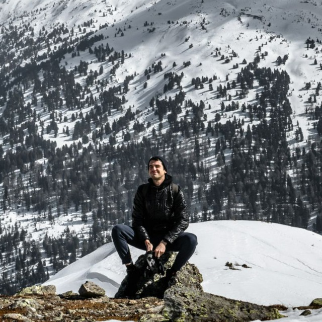

% Andrea Perin
% Andrea Perin
% 2025-08-27

# About

::: bio
{.bio-img}

::: bio-content
Hi! I am Andrea, a PhD student at **Aalto University**, under the supervision of professor [Stéphane Deny](https://sites.google.com/view/stephanedeny/home).

**Research interests:**

- symmetries and machine learning
- statistical mechanics
- information geometry
- diffusion models
:::
:::

### Contacts
- Email: andrea.perin [at] aalto.fi
- Twitter: [@perina_ndrea](https://x.com/perina_ndrea)
- [Scholar](https://scholar.google.com/citations?user=B4hZx88AAAAJ&hl=en)
- [GitHub](https://github.com/Andrea-Perin)

### News
- Sep 2025: [Our paper](https://www.jmlr.org/papers/volume26/24-2175/24-2175.pdf) on learning symmetries from data is now out on the JMLR website
- Aug 2025: Website (re)launched
- Jul 2025: Finally completed [a paper](https://arxiv.org/abs/2507.12419) on a novel MoE architecture! Look it up, it's really nice!
- May 2025: I spent two weeks at [University of Trieste](https://portale.units.it/en), where I worked on *biologically plausible learning rules*. Updates soon!
- Feb 2025: Started my internship at *Silvretta Inc.*, where I will work on Mixture of Experts models!
